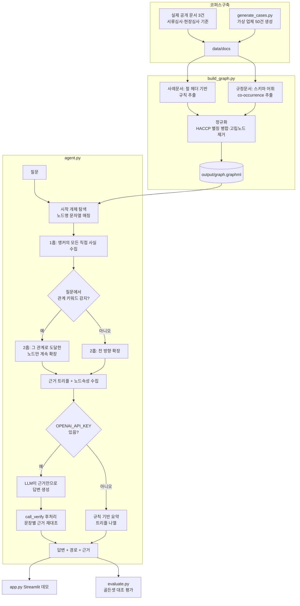
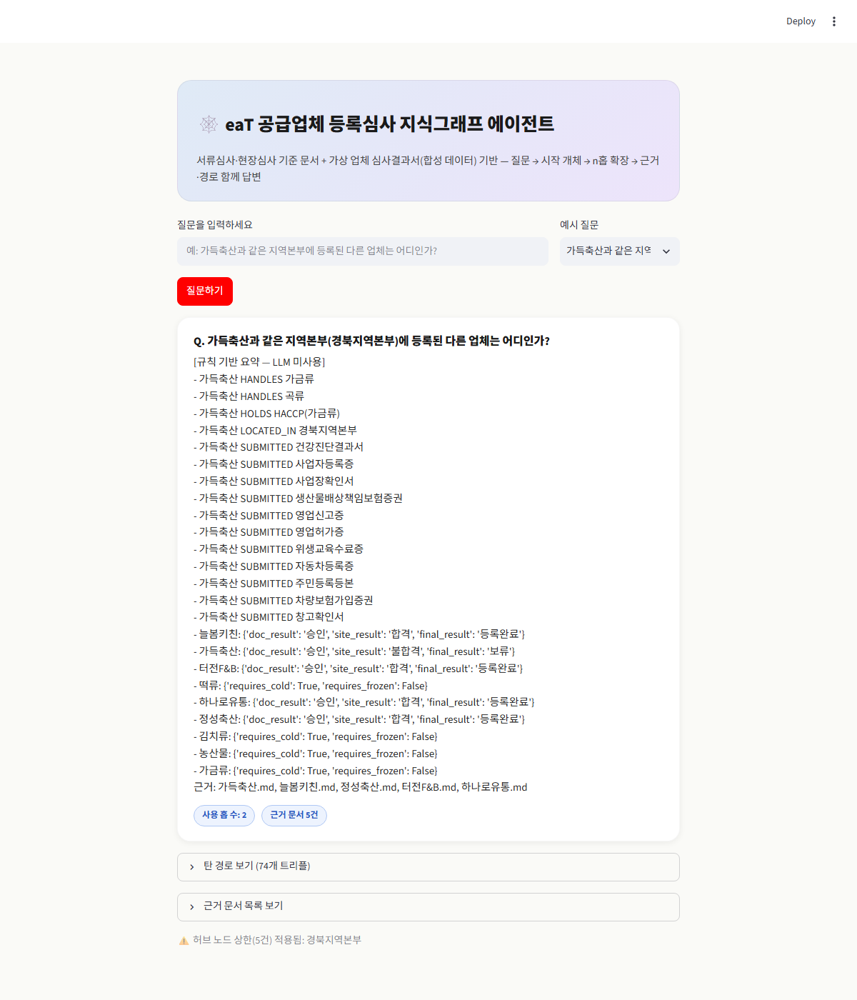

# REPORT — 공급업체 등록심사 지식그래프 에이전트

## 1. 주제와 코퍼스

**주제**: 공공급식통합플랫폼의 공급업체 등록심사(서류심사·현장심사)를 골랐다. 실무와 바로 연결되는 도메인이라는 점, 그리고 실제 심사기준 문서(공급업체 서류심사 세부기준·심사 퀵 가이드)가 노드·관계로 쪼개기 좋게 구조화되어 있다는 점(서류종류, 인증, 취급품목, 위반유형, 제재, 관계법령이 서로 참조 관계를 이룸)이 채택 이유다.

**코퍼스 구성 (총 53건)**:
1. **실제 공개 문서 3건** — 공급업체 서류심사 세부기준(개정), 심사 퀵 가이드(서류심사편·현장심사편). eaT가 공급사에게 공개 배포하는 안내자료라 개인정보·영업비밀이 없다.
2. **합성 사례문서 50건** — 위 기준을 바탕으로 만든 가상 업체의 등록심사 결과서.

**왜 합성 데이터인가**: 실제 심사 사례(서류심사·현장심사 결과)는 기관 내부자료이고 실제 업체명·개인정보를 포함한다. 이 과제는 실행 코드와 문서를 **공개 GitHub 저장소**에 올려야 하므로, 실제 사례를 그대로 쓰는 것은 애초에 검토 대상에서 제외했다. 대신 실제 심사 절차·기준 구조(어떤 서류가 필요한지, 위반유형이 무엇인지, 냉장·냉동 기준이 몇 도인지)는 그대로 가져오고, 업체명·수치만 가상으로 채웠다. 이렇게 하면 도메인 지식은 진짜인데 개인정보 노출 위험은 없는 코퍼스가 된다.

**탈락시킨 것**: 심사원 개인 식별정보, 실제 업체 상호, 실제 학교명. 대신 "지역본부" 단위로만 심사 주체를 추상화했다 — 실무 정확도는 조금 떨어지지만 개인정보 없는 공개 코퍼스라는 제약을 지키기 위한 선택이다.

## 2. 골든셋과 스키마

**스키마** (`config.json`): 노드 8종 — SupplyCompany · RegionalOffice · HandlingItem · Certification · DocumentType · ViolationType · Sanction · Regulation. 관계 8종 — LOCATED_IN · HANDLES · HOLDS · SUBMITTED · VIOLATED · RESULTS_IN · REQUIRES · GOVERNED_BY.

**뽑지 않은 관계와 그 대가**: 심사원이나 지역본부 담당자를 노드로 만들지 않았다 — 만들면 "같은 담당자가 심사한 업체는?" 같은 질문이 가능해지지만, 실존 인물 식별정보를 다루게 되어 이번 코퍼스 설계 원칙(개인정보 미포함)과 충돌한다. 그 대신 지역본부 단위 질문으로 대체했다.

**같은 개체를 하나로 합치는 기준**: 두 단계로 나눠서 처리한다.
1. **추출 시점에 표기를 통일한다** — `build_graph.py`가 원문에서 자유롭게 개체명을 뽑지 않고, `config.json`의 `vocab`(지역본부 10개·인증 10종·위반유형 16종 등 통제 어휘)과 정확히 일치하는 문자열만 노드로 만든다. "HACCP 축산물"과 "HACCP(축산물)"처럼 같은 개체가 다른 표기로 갈라질 여지를 추출 단계에서 원천 차단한다.
2. **추출 후 `normalize()`에서 별칭을 병합한다** — `HACCP(농산물)`, `HACCP(수산물)` 같은 품목별 세부 인증 6종은 각자 다른 인증서이지만, 전부 "상위 개념 HACCP을 보유했는가"라는 같은 질문에 답할 수 있어야 한다. 그래서 세부 인증 노드를 상위 `HACCP` 노드에 `IS_A` 엣지로 연결한다. 병합 기준은 "다른 문서에서 서로 다른 이름으로 등장한 것"이 아니라 (그런 사례는 추출 단계에서 이미 막혀 있다) "스키마상 하위 개념이 상위 개념의 한 사례인 것"이다.
3. 같은 정규화 단계에서 **일반명사성 잡음도 제거**한다 — 어떤 문서와도 연결되지 못한(차수 0) 노드는 고립 노드로 보고 그래프에서 뺀다. 이번 코퍼스에서는 통제 어휘 항목이 전부 실제로 쓰여서 해당 사례는 없었다.

**골든셋** (`data/goldenset.json`, 12문항, `build_goldenset.py`로 생성): 정답을 손으로 지어내지 않고 실제 생성된 코퍼스를 파싱해서 계산했다.
- **1홉 3건**: 문서 내부 사실 확인 (최종 심사결과, 보유 인증, 위반 없을 때 제재조치 — 마지막 문항은 "없는 걸 지어내는지" 확인하는 문항)
- **2홉 8건**: 같은 지역본부/취급품목/위반유형/인증을 공유하는 다른 업체(4건), 사례문서-규정문서 교차 질문(4건: 냉장·냉동 온도 기준, 건강진단 주기, HACCP 필수서류, 반려 후 재심사 기간)
- **근거없음 1건**: 코퍼스에 없는 개인정보(대표자 실명)를 묻는 네거티브 테스트 — "모른다"고 답해야 정답

**기대 경로를 정한 기준**: 실제 코퍼스에서 관측 가능한 관계만 경로에 넣었다. 단, 최종심사결과·서류심사결과 같은 값은 스키마상 별도 노드가 아니라 SupplyCompany 노드의 속성이라, 골든셋에는 `HAS_RESULT`라는 표기를 썼지만 이건 실제 그래프의 엣지가 아니라 속성 접근을 설명하기 위한 표기다(2절 하단 참고). 이 때문에 Q1·Q3의 "경로 재현율"이 0으로 나오는데, 이는 버그가 아니라 속성 vs 관계를 구분한 모델링 선택의 결과다.

**홉 수를 2로, 허브 캡을 5로 정한 기준**: 이 도메인은 SupplyCompany가 아닌 모든 노드(지역본부·서류종류·인증·품목·위반유형 등)가 최대 50개 업체까지 동시에 연결되는 허브가 될 수 있다. 앵커 업체 자신의 직접 사실(제출서류 등)은 전부 보여주되, 그 허브를 거쳐 "다른 업체"로 되짚어 나갈 때만 최대 5건으로 제한한다 — 안 그러면 사실상 전수조사가 되어 2홉 질문의 의미가 사라진다. 홉 수는 2까지만 허용한다 — 이 도메인의 2홉 질문 유형(같은 속성을 공유하는 업체, 사례-규정 교차 참조)은 전부 2홉 안에서 답이 나오고, 3홉 이상은 무관한 정보가 기하급수적으로 섞여 들어와 오히려 답의 정밀도를 해친다고 판단했다.

## 3. 측정 결과

`evaluate.py`로 골든셋 12문항을 GraphRAG와 basic RAG(그래프 없이 질문·문서 간 개체명 겹침만으로 상위 3건을 고르는 단순 키워드 검색)로 각각 돌려 근거 재현율을 비교했다. 아래는 실제 `OPENAI_API_KEY`(gpt-4o)를 연결해 LLM이 직접 답변을 생성한 실행 결과다.

| 홉 | 문항 수 | GraphRAG 근거재현율 | basic RAG 근거재현율 | GraphRAG 경로재현율 |
|---|---|---|---|---|
| 1홉 | 3 | 1.00 | 1.00 | 0.33 (속성 표기 이슈, 2절 참고) |
| 2홉 | 8 | 0.98 | 0.60 | 0.73 |

1홉에서는 GraphRAG와 basic RAG가 동률이다 — 답이 앵커 업체 문서 한 건 안에 다 있으니 키워드 검색만으로 충분하다. **2홉부터 격차가 벌어진다**(0.98 vs 0.60) — "같은 지역본부의 다른 업체"처럼 정답이 앵커와 아무 키워드도 안 겹치는 별도 문서에 있을 때, basic RAG는 애초에 그 문서를 검색 후보에 올리지 못하지만 GraphRAG는 그래프를 타고 찾아간다. 이게 이 프로젝트가 그래프 구조를 쓰는 이유를 그대로 보여주는 숫자다.

**실패층 분류** (`output/runs.jsonl`에 문항별 기록). 최종 결과는 **색인 0 · 탐색 1 · 생성 0**이지만, 여기까지 오는 과정에서 실패층이 세 번 자리를 옮겼다 — 그 과정 자체가 "왜 색인·탐색·생성을 나눠서 봐야 하는지"를 보여준다.

- **탐색 실패 1건 (Q4, 고정)**: 경북지역본부에 실제로는 앵커 포함 6개 업체가 있는데, 허브 캡(5)에 걸려 1곳이 결과에서 빠졌다. 우리가 정한 트레이드오프(허브 폭발 방지 vs 완전 재현)가 그대로 드러난 사례로, 설계상 의도된 동작이다.
- **생성 실패, 1차 (`OPENAI_API_KEY` 연결 전)**: Q3("가온식품이 받은 제재조치는?")가 잡혔다. 근거(위반사항 없음)는 맞게 모았는데, 그때는 API 키 없이 규칙 기반 요약(트리플 나열)만 돌려서 "해당없음"이라는 결론 문장을 스스로 못 만들었기 때문이다.
- **생성 실패, 2차 (API 키 연결 후)**: Q3는 해결됐지만 대신 Q6("가득축산과 같은 위반사항을 받은 다른 업체는 어떤 제재를 받았는가?")에서 **진짜 환각**이 나왔다. 근거 재현율은 1.0(든든축산·온누리키친·청솔키친 문서 전부 확보)인데도 LLM이 "이들 업체는 모두 이용제한 1개월의 제재를 받았습니다"라고 답했다 — 실제로는 든든축산만 이용제한_1개월이고 온누리키친·청솔키친은 서류_보완요청인데, 근거에 서로 다르다고 분명히 적혀 있는 걸 하나로 뭉뚱그렸다. 검색은 100% 성공했고 생성 단계에서만 깨진 사례다. `agent.py`의 `ANSWER_SYSTEM_PROMPT`에 "여러 업체를 하나로 뭉뚱그리지 말고 업체별로 삼중항을 짚어 답하라"는 지시와 "쓰기 전에 각 문장이 실제 삼중항과 대응하는지 스스로 확인하라"는 지시를 추가하자 해결됐다 — 같은 질문을 다시 던지자 든든축산은 이용제한_1개월, 온누리키친·청솔키친은 서류_보완요청으로 정확히 구분해 답했다.
- **생성 실패, 3차 — 사실은 평가지표 버그**: 프롬프트를 고친 뒤에도 `evaluate.py`가 Q6을 계속 생성 실패로 잡았다. 확인해보니 LLM은 이미 "든든축산: 이용제한 1개월 / 온누리키친: 서류 보완 요청 / 청솔키친: 서류 보완 요청"으로 정확히 답하고 있었는데, `classify_failure()`가 기대정답의 `이용제한_1개월`(밑줄 코드 표기)을 LLM의 자연스러운 `이용제한 1개월`(띄어쓰기)과 문자열이 다르다는 이유로 놓치고 있었다. 밑줄/공백을 정규화하고 비교하도록 `evaluate.py`를 고치자 생성 실패가 0건이 됐다.

정리하면: 실제로 있었던 문제는 두 개였다 — (1) API 키 없이 돌리면 결론 문장을 못 만드는 것(설계상 당연한 한계), (2) LLM이 여러 업체의 사실을 뭉뚱그리는 것(프롬프트로 해결). 세 번째는 실패가 아니라 평가 스크립트 자체의 문자열 비교 버그였다 — 실패층 분류를 신뢰하려면 분류기 자체도 검증해야 한다는 걸 이번에 확인했다.

이 사고를 `test_evaluate.py`에 회귀 테스트로 남겼다(`pytest test_evaluate.py -v`) — `classify_failure()`가 정답의 밑줄 코드 표기와 LLM의 자연어 표기를 같은 값으로 보는지 등 채점 함수 자체를 검증한다. 정규화 로직을 일부러 되돌려서 이 테스트가 실제로 실패하는 것까지 확인했다(진짜로 그 버그를 잡아내는 테스트라는 뜻).

## 4. 파이프라인 구조

**LangGraph를 안 쓴 이유**: 이 에이전트의 흐름(개체 탐색 → 홉 확장 → 답변)은 분기가 거의 없는 결정론적 파이프라인이라, 상태 그래프 프레임워크 없이도 함수 호출 체인으로 충분히 표현된다. 조건 분기(관계 키워드 유무, API 키 유무)는 두 곳뿐이라 `if`로 처리했다.

## 5. 데모 설계

Streamlit으로 만들었다(`app.py`). 신경 쓴 부분:
- **예시 질문 드롭다운**: 골든셋 12문항을 그대로 선택지로 노출해서, 채점자가 코드를 안 봐도 바로 재현 가능한 질문으로 테스트할 수 있게 했다.
- **답변과 경로를 분리**: 답변 카드는 짧게, "탄 경로 보기"는 접어서 필요할 때만 펼치게 했다 — 2홉 질문은 경로가 수십~백여 개 트리플이 될 수 있어(허브 확장 때문에) 기본 화면에 다 펼쳐두면 정작 답변이 묻힌다.
- **허브 캡 적용 여부 표시**: 상한(5건)에 걸려 결과가 잘렸을 때 이를 화면에 캡션으로 표시해, "이게 전부"가 아니라 "상위 5건"이라는 걸 사용자가 알 수 있게 했다.

위는 실제 `OPENAI_API_KEY`를 연결한 상태에서 Q6("가득축산과 같은 위반사항을 받은 다른 업체는 어떤 제재를 받았는가?")를 물어본 결과다. 3절에서 다룬 환각을 프롬프트 수정으로 고친 뒤라, 든든축산·온누리키친·청솔키친 세 업체의 서로 다른 제재가 뭉뚱그려지지 않고 각각 정확히 구분되어 나온다.

## 6. 프로젝트 회고

**가장 공들인 부분**: 홉 확장 정책. 처음엔 "1홉에서 뭔가 찾으면 멈추고, 없으면 2홉으로 넓힌다"는 단순한 규칙을 짰는데, 앵커 업체는 거의 항상 1홉에 자기 자신의 제출서류 같은 사실이 있어서 2홉 질문(같은 지역본부의 다른 업체는?)이 사실상 항상 1홉에서 조기 종료되는 버그가 있었다. 그다음엔 무조건 2홉까지 다 넓히도록 고쳤더니, 이번엔 지역본부·품목·서류종류 등 모든 방향으로 다 퍼져서 노이즈에 답이 묻히는 문제가 났다. 최종적으로 "질문 표현에서 관계를 추론해 2홉째는 그 방향으로만 좁힌다" + "허브 캡은 업체행 이웃에만 적용한다"는 두 규칙으로 정리했다. 실제로 돌려보면서 세 번 바꾼 설계다.

**향후 개선점**:
1. 관계 감지가 키워드 매칭이라("지역본부"→LOCATED_IN 등) 표현이 다르면 못 잡는다. LLM으로 질문의 관계 의도를 파싱하면 더 견고해질 것이다.
2. (해결됨, 3절 참고) LLM을 실제로 연결해보니 업체마다 다른 값을 가진 관계(위반유형별 제재)를 물으면 여러 업체의 사실을 하나로 뭉뚱그리는 환각이 나왔다. `ANSWER_SYSTEM_PROMPT`에 "업체별로 삼중항을 짚어 개별 확인하라"는 지시를 추가한 데 더해, **`call_verify()` 후처리 단계**(`agent.py`)를 붙였다 — 답변 생성 후 별도 LLM 호출로 각 문장이 근거와 실제로 대응하는지 다시 대조하고, 뒷받침 안 되는 주장은 빼거나 고쳐서 `revised_answer`를 돌려준다.

   처음 붙였을 때는 흥미로운 한계가 있었다: `RESULTS_IN` 엣지가 `ViolationType → Sanction`으로만 있고 `SupplyCompany → Sanction` 직접 엣지가 없다 보니, 검증기가 틀린 정보를 "정확한 값으로 수정"하지 못하고 아예 "근거 불충분"으로 보고 해당 문장을 통째로 빼버렸다 — 틀린 정보를 내보내지는 않지만 회수 가능한 정보까지 과도하게 걸러내는 셈이었다. `build_graph.py`에 `SupplyCompany -[RESULTS_IN]-> Sanction` 직접 엣지를 추가(`config.json` 스키마에도 반영)하자, 같은 일부러 틀린 답("세 업체 모두 이용제한 1개월") 테스트에서 이번엔 문장을 지우지 않고 "온누리키친과 청솔키친은 서류 보완 요청을 받았다"로 정확히 고쳐 썼다. 간접 추론이 필요 없는 직접 엣지 하나가 검증 단계의 신뢰도를 실질적으로 바꾼 사례다.
3. 코퍼스가 합성이라 실제 심사 데이터에 있을 법한 예외 사례(애매한 반려 사유, 서류 간 모순 등)가 부족하다. 실제 배포 전에는 익명화된 실제 사례 일부로 검증이 필요하다.
