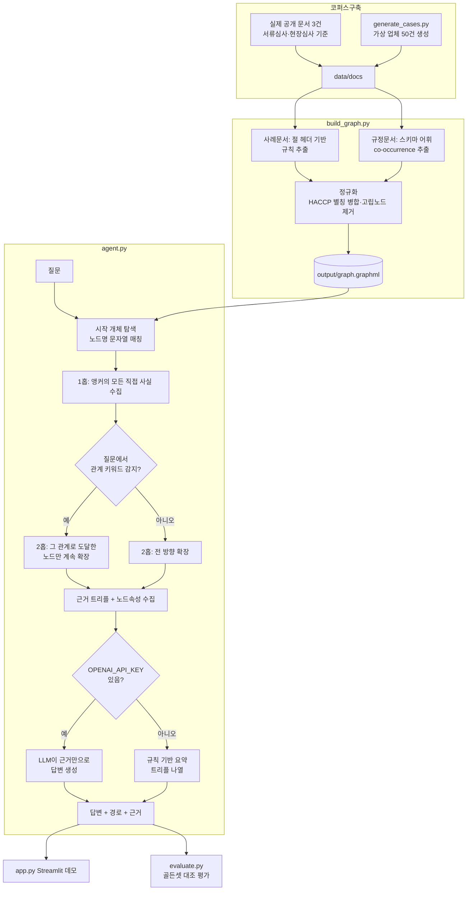

# REPORT — eaT 공급업체 등록심사 지식그래프 에이전트

## 1. 주제와 코퍼스

**주제**: eaT 공공급식통합플랫폼의 공급업체 등록심사(서류심사·현장심사)를 골랐다. aT(한국농수산식품유통공사) 소속으로 실무와 바로 연결되는 도메인이라는 점, 그리고 실제 심사기준 문서(공급업체 서류심사 세부기준·심사 퀵 가이드)가 노드·관계로 쪼개기 좋게 구조화되어 있다는 점(서류종류, 인증, 취급품목, 위반유형, 제재, 관계법령이 서로 참조 관계를 이룸)이 채택 이유다.

**코퍼스 구성 (총 53건)**:
1. **실제 공개 문서 3건** — 공급업체 서류심사 세부기준(개정), 심사 퀵 가이드(서류심사편·현장심사편). eaT가 공급사에게 공개 배포하는 안내자료라 개인정보·영업비밀이 없다.
2. **합성 사례문서 50건** — 위 기준을 바탕으로 만든 가상 업체의 등록심사 결과서.

**왜 합성 데이터인가**: 실제 심사 사례(서류심사·현장심사 결과)는 기관 내부자료이고 실제 업체명·개인정보를 포함한다. 이 과제는 실행 코드와 문서를 **공개 GitHub 저장소**에 올려야 하므로, 실제 사례를 그대로 쓰는 것은 애초에 검토 대상에서 제외했다. 대신 실제 심사 절차·기준 구조(어떤 서류가 필요한지, 위반유형이 무엇인지, 냉장·냉동 기준이 몇 도인지)는 그대로 가져오고, 업체명·수치만 가상으로 채웠다. 이렇게 하면 도메인 지식은 진짜인데 개인정보 노출 위험은 없는 코퍼스가 된다.

**탈락시킨 것**: 심사원 개인 식별정보, 실제 업체 상호, 실제 학교명. 대신 "지역본부" 단위로만 심사 주체를 추상화했다 — 실무 정확도는 조금 떨어지지만 개인정보 없는 공개 코퍼스라는 제약을 지키기 위한 선택이다.

## 2. 골든셋과 스키마

**스키마** (`config.json`): 노드 8종 — SupplyCompany · RegionalOffice · HandlingItem · Certification · DocumentType · ViolationType · Sanction · Regulation. 관계 8종 — LOCATED_IN · HANDLES · HOLDS · SUBMITTED · VIOLATED · RESULTS_IN · REQUIRES · GOVERNED_BY.

**뽑지 않은 관계와 그 대가**: 심사원이나 지역본부 담당자를 노드로 만들지 않았다 — 만들면 "같은 담당자가 심사한 업체는?" 같은 질문이 가능해지지만, 실존 인물 식별정보를 다루게 되어 이번 코퍼스 설계 원칙(개인정보 미포함)과 충돌한다. 그 대신 지역본부 단위 질문으로 대체했다.

**골든셋** (`data/goldenset.json`, 12문항, `build_goldenset.py`로 생성): 정답을 손으로 지어내지 않고 실제 생성된 코퍼스를 파싱해서 계산했다.
- **1홉 3건**: 문서 내부 사실 확인 (최종 심사결과, 보유 인증, 위반 없을 때 제재조치 — 마지막 문항은 "없는 걸 지어내는지" 확인하는 문항)
- **2홉 8건**: 같은 지역본부/취급품목/위반유형/인증을 공유하는 다른 업체(4건), 사례문서-규정문서 교차 질문(4건: 냉장·냉동 온도 기준, 건강진단 주기, HACCP 필수서류, 반려 후 재심사 기간)
- **근거없음 1건**: 코퍼스에 없는 개인정보(대표자 실명)를 묻는 네거티브 테스트 — "모른다"고 답해야 정답

**기대 경로를 정한 기준**: 실제 코퍼스에서 관측 가능한 관계만 경로에 넣었다. 단, 최종심사결과·서류심사결과 같은 값은 스키마상 별도 노드가 아니라 SupplyCompany 노드의 속성이라, 골든셋에는 `HAS_RESULT`라는 표기를 썼지만 이건 실제 그래프의 엣지가 아니라 속성 접근을 설명하기 위한 표기다(2절 하단 참고). 이 때문에 Q1·Q3의 "경로 재현율"이 0으로 나오는데, 이는 버그가 아니라 속성 vs 관계를 구분한 모델링 선택의 결과다.

**홉 수를 2로, 허브 캡을 5로 정한 기준**: 이 도메인은 SupplyCompany가 아닌 모든 노드(지역본부·서류종류·인증·품목·위반유형 등)가 최대 50개 업체까지 동시에 연결되는 허브가 될 수 있다. 앵커 업체 자신의 직접 사실(제출서류 등)은 전부 보여주되, 그 허브를 거쳐 "다른 업체"로 되짚어 나갈 때만 최대 5건으로 제한한다 — 안 그러면 사실상 전수조사가 되어 2홉 질문의 의미가 사라진다. 홉 수는 2까지만 허용한다 — 이 도메인의 2홉 질문 유형(같은 속성을 공유하는 업체, 사례-규정 교차 참조)은 전부 2홉 안에서 답이 나오고, 3홉 이상은 무관한 정보가 기하급수적으로 섞여 들어와 오히려 답의 정밀도를 해친다고 판단했다.

## 3. 측정 결과

`evaluate.py`로 골든셋 12문항을 GraphRAG와 basic RAG(그래프 없이 질문·문서 간 개체명 겹침만으로 상위 3건을 고르는 단순 키워드 검색)로 각각 돌려 근거 재현율을 비교했다.

| 홉 | 문항 수 | GraphRAG 근거재현율 | basic RAG 근거재현율 | GraphRAG 경로재현율 |
|---|---|---|---|---|
| 1홉 | 3 | 1.00 | 1.00 | 0.33 (속성 표기 이슈, 2절 참고) |
| 2홉 | 8 | 0.98 | 0.60 | 0.73 |

1홉에서는 GraphRAG와 basic RAG가 동률이다 — 답이 앵커 업체 문서 한 건 안에 다 있으니 키워드 검색만으로 충분하다. **2홉부터 격차가 벌어진다**(0.98 vs 0.60) — "같은 지역본부의 다른 업체"처럼 정답이 앵커와 아무 키워드도 안 겹치는 별도 문서에 있을 때, basic RAG는 애초에 그 문서를 검색 후보에 올리지 못하지만 GraphRAG는 그래프를 타고 찾아간다. 이게 이 프로젝트가 그래프 구조를 쓰는 이유를 그대로 보여주는 숫자다.

**실패층 분류** (`output/runs.jsonl`에 문항별 기록):
- **색인 실패 0건**: 추출 단계에서 통째로 빠진 사실은 없었다.
- **탐색 실패 1건 (Q4)**: 경북지역본부에 실제로는 앵커 포함 6개 업체가 있는데, 허브 캡(5)에 걸려 1곳이 결과에서 빠졌다. 우리가 정한 트레이드오프(허브 폭발 방지 vs 완전 재현)가 그대로 드러난 사례다.
- **생성 실패 1건 (Q3)**: 근거(위반사항 없음)는 다 모았는데, 이번 실행이 `OPENAI_API_KEY` 없이 규칙 기반 요약(트리플 나열)으로 돌아서 "해당없음"이라는 결론 문장을 스스로 못 만들었다. LLM을 연결하면 해소되는 문제로, 검색·추출이 아니라 순수 생성 단계의 한계다.

## 4. 파이프라인 구조

**LangGraph를 안 쓴 이유**: 이 에이전트의 흐름(개체 탐색 → 홉 확장 → 답변)은 분기가 거의 없는 결정론적 파이프라인이라, 상태 그래프 프레임워크 없이도 함수 호출 체인으로 충분히 표현된다. 조건 분기(관계 키워드 유무, API 키 유무)는 두 곳뿐이라 `if`로 처리했다.

## 5. 데모 설계

Streamlit으로 만들었다(`app.py`). 신경 쓴 부분:
- **예시 질문 드롭다운**: 골든셋 12문항을 그대로 선택지로 노출해서, 채점자가 코드를 안 봐도 바로 재현 가능한 질문으로 테스트할 수 있게 했다.
- **답변과 경로를 분리**: 답변 카드는 짧게, "탄 경로 보기"는 접어서 필요할 때만 펼치게 했다 — 2홉 질문은 경로가 수십~백여 개 트리플이 될 수 있어(허브 확장 때문에) 기본 화면에 다 펼쳐두면 정작 답변이 묻힌다.
- **허브 캡 적용 여부 표시**: 상한(5건)에 걸려 결과가 잘렸을 때 이를 화면에 캡션으로 표시해, "이게 전부"가 아니라 "상위 5건"이라는 걸 사용자가 알 수 있게 했다.

(로컬 실행 화면 캡처는 `assets/demo_screenshot.png`로 README에 추가 예정 — 이 세션에서는 내장 브라우저로 질문 입력→답변→경로/근거 표시까지 직접 확인했다.)

## 6. 프로젝트 회고

**가장 공들인 부분**: 홉 확장 정책. 처음엔 "1홉에서 뭔가 찾으면 멈추고, 없으면 2홉으로 넓힌다"는 단순한 규칙을 짰는데, 앵커 업체는 거의 항상 1홉에 자기 자신의 제출서류 같은 사실이 있어서 2홉 질문(같은 지역본부의 다른 업체는?)이 사실상 항상 1홉에서 조기 종료되는 버그가 있었다. 그다음엔 무조건 2홉까지 다 넓히도록 고쳤더니, 이번엔 지역본부·품목·서류종류 등 모든 방향으로 다 퍼져서 노이즈에 답이 묻히는 문제가 났다. 최종적으로 "질문 표현에서 관계를 추론해 2홉째는 그 방향으로만 좁힌다" + "허브 캡은 업체행 이웃에만 적용한다"는 두 규칙으로 정리했다. 실제로 돌려보면서 세 번 바꾼 설계다.

**향후 개선점**:
1. 관계 감지가 키워드 매칭이라("지역본부"→LOCATED_IN 등) 표현이 다르면 못 잡는다. LLM으로 질문의 관계 의도를 파싱하면 더 견고해질 것이다.
2. `evaluate.py`의 생성 실패 1건은 실제 LLM(OPENAI_API_KEY)을 연결해서 다시 측정해봐야 한다 — 지금은 규칙 기반 요약만으로 돌린 결과다.
3. 코퍼스가 합성이라 실제 심사 데이터에 있을 법한 예외 사례(애매한 반려 사유, 서류 간 모순 등)가 부족하다. 실제 배포 전에는 익명화된 실제 사례 일부로 검증이 필요하다.
